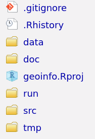
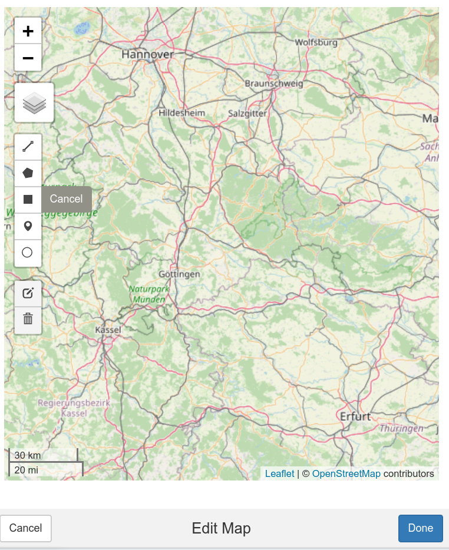

Am Beispiel eines typischen Arbeitsablaufs könne sowohl die frisch erworbenen R-Fertigkeiten gefestigt  als auch eine gute Arbeitspraxis eingeübt werden. Die Fragestellung mit der wir uns beschäftigen wollen ist die Erfassung der flächenhaften Verluste von Fichtenwald am Beispiel des Westharzes.

# Setup

Grundsätzlich können Sie dies bereits mit ihren Basis-Fähigkeiten erfolgreich bearbeiten. Damit Sie sofort mit einer guten Struktur starten treffen wir noch ein paar Vorbereitungen. Zunächst installieren sie bitte das Paket `envimaR`. Da das Paket auf `Github` zur Verfügung gestellt wird müssen wir es wie folgt
installieren:


```r

# first install the utility package devtools
install.packages("devtools)

# Install envimaR
devtools::install_github("envima/envimaR")
```

Wir benötigen dieses Paket um bequem eine definierte Areitsumgebung zu erzeugen.

Nach der Installation navigieren Sie zu `File->New Project->New Directory`. Dann scrollen Sie nach unten bis zur Auswahl `Project structure with envimaR`. Diese wählen Sie aus. Navigieren sie zu einem Verzeichnis ihrer Wahl. Geben sie einen Projektnamen ein z.B. `geoinfo`. Das Projekt wird im angegebenen Ordner geöffnet und sollte im Reiter `Files` so aussehen:



Doppelklicken Sie auf das Verzeichnis `src` und dann den Unterordner `functions`. Hier öffnen Sie die Datei `000_setup.R` durch Doppelklick. Ersetzen Sie den kompletten Inhalt dieser Datei durch den Inhalt des folgenden Scripts:
<script src="https://gist.github.com/gisma/3dfbdd4de0d5b23e51df9885475da82f.js"></script>

Dann speichern und schliessen Sie bitte die Datei. Fürs Erste ist damit die Vorbereitung abgeschlossen.


## Sentinel-Satellitendaten - sen2r

Satellitendaten sind mittlerweile prinzipiell sowohl als Rohdaten als auch in den unterschiedlichsten Produkten leicht zugänglich. Ein Beispiel für eine Satelliten Mission, deren Daten standardmäßig in der Umwelt-Fernerkundung verwendet werden, ist die [Sentinel-2-Mission](https://sentinel.esa.int/web/sentinel/missions/sentinel-2) der Europäischen Weltraumorganisation. In R sind diese Daten dank des Pakets `sen2r` sehr einfach verfügbar.

Um `sen2r` zu installieren, müssen Sie `Rtools` installiert haben.

1. Öffnen Sie [http://cran.r-project.org/bin/windows/Rtools/](http://cran.r-project.org/bin/windows/Rtools/) 
1. Wählen Sie den Download-Link, der Ihrer Version von `R` entspricht
1. Öffnen Sie die .exe-Datei und verwenden Sie die Standardeinstellungen
1. **Vergewissern Sie sich, dass Sie das Kästchen ankreuzen, damit das Installationsprogramm Ihren PATH bearbeiten kann**
1. Führen Sie `library(devtools)` in `R` aus
1. Führen Sie `find_rtools()` aus -- wenn `TRUE`, hat die Installation korrekt funktioniert

Dann muss das Paket nur noch wie jedes andere Paket installiert werden:

```r
install.packages("sen2r")
library(sen2r)
```

### Die `sen2r`-GUI

Damit Sie Sentinel Daten benutzen können müssen Sie bei SciHub ein [Konto anlegen](https://scihub.copernicus.eu/dhus/#/self-registration)!

Der einfachste Weg, `sen2r` zu benutzen, ist, die grafische Benutzeroberfläche (GUI) zu öffnen und sie im interaktiven Modus zu benutzen. Allerdings muss man hier in den Einstellungen aus einer Vielzahl von Optionen wählen. Die dafür erforderlichen Kenntnisse sind auch für die unten vorgestellte Kommandozeilenversion notwendig. Beide Schnittstellen können automatisiert werden. Wir empfehlen die API, aber letztlich bleibt es Ihnen überlassen. Verwenden Sie dazu die gleichnamige Funktion.

```r
sen2r::sen2r()
```


## Change Detection mit Sentinel Daten

Wir eingangs bereits angesprochen planen wir die Veränderung der Waldbedeckung im Harz zu quantifizieren. Nachdem wir die Vorbereitung abgeschlossen haben (Anlegen der Projektumgebung und Einrichten des sen2r Pakets inkl. des Kontos bei Copernicus) kann es nun losgehen.

Was zu tun ist:

1. Festlegen der zentralen Parameter wie z.B. Datum (Zeitreihe), Bildausschnitt (AOI),sowie weiterer Parameter wie zb. verschiedene Verzeichnisse.
2. Herunterladen der Daten durch Aufruf der konfigurierten `sen2r::sen2r()` Funktion. Diese lädt dann über die sogenannte API von Copernicus die Daten herunter oder sendet eine email, falls die angeforderten Daten  erst aus dem *Langzeitspeicher* geladen werden müssen. 
3. Berechnen der Oberflächenalbedo  (beipielhaft)


Öffnen Sie die Datei `main.R` im Ordner `src` durch Doppelklick. Ersetzen sie den Inhalt des Skriptes durch das das nachfolgnden Skript:

<script src="https://gist.github.com/gisma/5a11edd28cf81cee523e273b0064bcea.js"></script>

Speichen Sie die `main.R`

Im diesem Skript werden Sentinel-2-Daten für den Juni 2019 und ein spezielles Gebiet (Area of Interest AOI) heruntergeladen. Zusätzlich wird exemplarisch die Oberflächenalbedo berechnet. 

Zu Beginn muss ein Ausschnitt digitalisiert werden. Nutzen Sie hierzu den Befehl `harz = mapedit::editMap()`. Das Interface ist selbsterklärend und schaut (nachdem sie auf den Harz gezoomed haben und die Karte auf Openstreetmap umgesetellt haben) wie folgt aus:



Klicken sie auf das Viereck und ziehen sie den Ausschnitt für den sie Sentinel Daten suchen. Beenden sie den Vorgang mit `Done`.


Die [sen2r vignette](https://sen2r.ranghetti.info/) bietet viele hilfreiche Informationen über die Benutzung der GUI und den Zugriff auf die Funktionen von `sen2r` aus `R` heraus.


## Zusammenfassung

* Das Projekt-Setup mit envimaR und das Auswerte Skript bietet Ihnen einen vollständigen organisatorischen Rahmen zur Bearabeitung aller auch  komplexerer und aufwendigerer Aufgaben
* sen2r liefert Ihnen einen sehr komfortablen und reproduzierbaren Zugriff auf umfangreiche Sentinel Daten
* Prinzipiell kennen Sie nun die zentralen Werkezeuge und Vorgehensweisen um mit Hilfe von R automatisiert und reproduzierbar räumliche Analysen durchzuführen


<div class="boxInfo">
<p class="textline"> 
Sie können alle notwendigen Skripte und Daten aus dem github repository
    <a href="https://github.com/gisma/geoinfo/archive/refs/heads/main.zip"> laden
      </a>.
      Alternativ können sie das Repo auch als Projekt in Rstudio anlegen 
      <a href="https://www.r-bloggers.com/2015/07/rstudio-and-github/">
Rstudio github
      </a>.    
</div>
