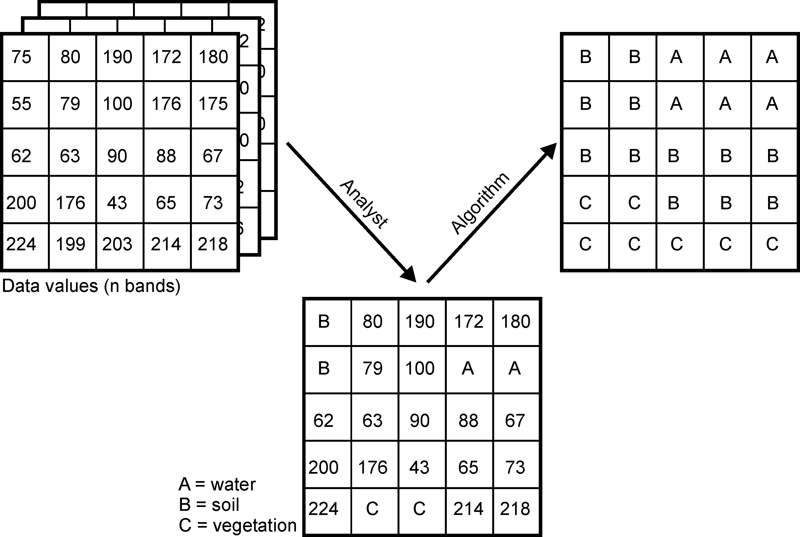
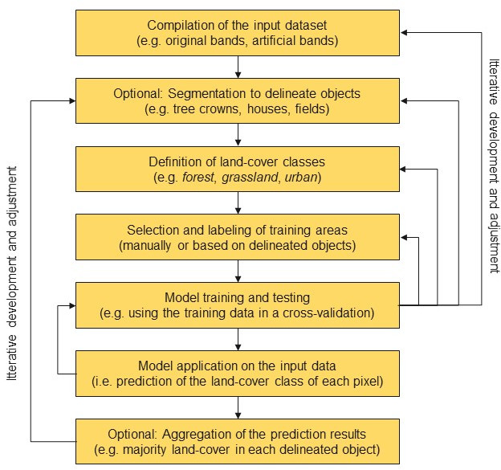

In den Geowissenschaften ist die Fernerkundung die einzige Messtechnik, die eine vollständige Abdeckung großer räumlicher Skalen ermöglicht. Zur Forschung gehört notwendigerweise auch die Entwicklung eigener Methoden, insbesondere im Hinblick auf die Verarbeitungsketten, aber auch in der Kopplung geeigneter und etablierter Methoden.  

Ein zentraler Bestandteil der Umweltinformatik ist die Veränderungsdetektion mittels Satelliten-, Flugzeug- und Drohnenbildern. Oft wird dies in Verbindung mit bio- und geophysikalischen oder vom Menschen verursachten Prozessen genutzt, um ein tieferes Verständnis und die Möglichkeit zur Entwicklung von Vorhersagemodellen zu erhalten. Dabei sind Bildanalysemethoden von zentraler Bedeutung, um Informationen zu extrahieren, die es erlauben, die zugrunde liegenden Prozesse zu identifizieren. Ein immer wichtigerer Aspekt ist die Integration von Big Data-Analysen.

Die wachsende und jetzt schon überwältigende Flut an verfügbaren Bild- und Fernerkundungsdaten muss leicht zugänglich sein und sowohl für den wissenschaftlichen Erkenntnisgewinn als auch für gesellschaftliche Zukunftsaufgaben genutzt werden. Wir beginnen mit dieser praktischen Anwendung in dieser Übung.

## Vorgehensweise

Unverarbeitete Satellitenbilder sind nicht unbedingt informativ. Unser Auge kann ein Echtfarbenbild relativ leicht interpretieren, aber eine zuverlässige und reproduzierbare wissenschaftliche Interpretation erfordert andere Ansätze. Außerdem können Bildverarbeitungsmethoden zusätzliche, spezifischere Informationen ableiten. Wir haben bereits einfache Indices berechnet. Auch die Ableitung der Oberflächenalbedo ist ebenfalls eine physikalisch begründete Umwandlung von Bildsignalen in eine physikalische Größe. 

Um nützliche Informationen, z. B. über die Bodenbedeckung in einem Gebiet, zu erhalten, müssen wir die Daten daher zielgerichtet analysieren. Der bekannteste und gängigste Ansatz ist die Klassifizierung der Bilder in Kategorien die von Interesse sind.

Diese Übung führt Sie in die Klassifizierung von Satelliten- und Luftvermessungsdaten in `R` ein. Als solche deckt sie das Folgende ab:

1. Vorbereiten der Arbeitsumgebung und Laden der Daten
1. Quick & dirty Digtalisierung von Trainingsbereichen 
1. unüberwachte/überwachte Klassifizierung 
  * k-means (über `RStoolbox`)
  * Rekursive Partitionierung und Regressionsbäume (über `rpart`)
  * Random Forest (über `caret`) 


## Change Detection Waldveränderung Nord-West-Harz

In diesem Tutorium werden die Sentinel-2-Bilder aus der vorherigen Übung verwendet. 

## Schritt 1 - Einrichten des Skripts
Sie können entweder die gespeicherten Daten aus der vorangegangenen Einheit verwenden oder einen neuen Abschnitt zum Üben herunterladen und bearbeiten. Im Prinzip wird jedoch zuerst die Arbeitsumgebung geladen.
```r
#------------------------------------------------------------------------------
# Type: script
# Name: get_sentinel.R
# Author: Chris Reudenbach, creuden@gmail.com
# Description:  retrieves sentinel data 
#               and exemplary defines AOI and calculates albedo
# Dependencies: 
# Output: original sentinel tile 
#         AOI window of this tile (research_area)
#         top of atmosphere albedo AOI
#         surface albedo AOI
# Copyright: GPL (>= 3)
#------------------------------------------------------------------------------

# laden der notwendigen Bibliotheken
## Achtung sie müssen evtl. installiert werden
library(envimaR)
library(rprojroot)
## setzen des aktuellen Projektverzeichnisses (erstellt mit envimaR) als rootDIR
rootDIR = find_rstudio_root_file()

# einlesen des zuvor erstellten setup Srkiptes
source(file.path(rootDIR, "src/functions/000_setup.R"))


```
Bitte ergänzen Sie die Bibliotheken in ihrem setupskript um die folgenden:

```r
 c("rprojroot","sen2R","terra","patchwork","ggplot2",
 "mapedit","dplyr","mapview","tidyverse","rpart","rpart.plot",
 "rasterVis","caret","forcats","RStoolbox","randomForest", "e1071")
```
Auf der Grundlage der verfügbaren Sentinel Daten  sollten nun zunächst geeignete Datensätze für eine Oberflächenklassifikation identifiziert werden. Hierzu kann der vollständige Datensatz auch vom Kursdatenserver [heruntergeladen](http://gofile.me/3Z8AJ/7Ika7zY9x) werden (Bitte beachten Sie dass sie im VPN bzw. UniNetz angemeldet sein müssen).Entpacken Sie diese Daten in das Wurzelverzeichnis des Kursprojekts.Das heist der `data` Ordenr wird ersetzt/ergänzt.

## Kurze Einführung in Klassifkation

### Überwachte Klassifizierung

Bei der überwachten Klassifizierung von Landbedeckungen wird aus einer begrenzten Menge sogenannter Trainingsdaten ein Modell abgeleitet, das die jeweilige Landbedeckung im gesamten Datensatz vorhersagt. Die Landbedeckungstypen werden also *a priori* definiert, und das Modell versucht, diese Typen auf der Grundlage der Ähnlichkeit zwischen den Eigenschaften der Trainingsdaten und dem Rest des Datensatzes vorherzusagen.




Solche Klassifizierungen erfordern im Allgemeinen mindestens fünf Schritte:
1. Zusammenstellung eines umfassenden Eingabedatensatzes, der eine oder mehrere Rasterebenen enthält.
1. Auswahl von Trainingsgebieten, d.h. Teilmengen von Eingabedatensätzen, für die der Fernerkundungsexperte den Landbedeckungstyp kennt. Das Wissen über die Landbedeckung kann z.B. aus eigenen oder fremden *in situ* Beobachtungen, Managementinformationen oder anderen Fernerkundungsprodukten (z.B. hochauflösenden Luftbildern) gewonnen werden.

1. Training eines Modells unter Verwendung der Trainingsflächen. Zu Validierungszwecken werden die Trainingsflächen häufig in eine oder mehrere Test- und Trainingsstichproben unterteilt, um die Leistung des Modellalgorithmus zu bewerten.
1. Anwendung des trainierten Modells auf den gesamten Datensatz, d. h. Vorhersage der Bodenbedeckungsart auf der Grundlage der Ähnlichkeit der Daten an jedem Ort mit den Klasseneigenschaften des Trainingsdatensatzes.

Bitte beachten Sie, dass alle Arten der Klassifizierung eine gründliche Validierung erfordern, die im Mittelpunkt der kommenden Kurseinheiten stehen wird.

Die folgende Abbildung zeigt die Schritte einer überwachten Klassifikation im Detail. Die optionalen Segmentierungsoperationen sind obligatorisch für objektorientierte Klassifizierungen, die sich nicht nur auf die Geometrie der Objekte, sondern auch auf die Werte jeder einzelnen Rasterzelle im Eingabedatensatz stützen. Um einzelne Objekte wie Häuser oder Baumkronen abzugrenzen, verwenden Fernerkundungsexperten Segmentierungsalgorithmen, die die Homogenität der Pixelwerte innerhalb ihrer räumlichen Nachbarschaft berücksichtigen. 




## Zweiter Schritt Übersicht verschaffen 

1. Welche der Daten sind für eine visuelle Inspektion interessant und wo sind sie abgelegt?
2. Welche Daten sind interessant für eine Klassifikation?

Bei näherer Betrachtung der RGB Bilder (RGB432B) zeigt sich das zwei Datensätze aufgrund der Bildqualität und Wolkenbedeckung geeignet zu sein scheinen. Der 24.7.2019 und der 30.7. 2020.

zunächst einmal benötigen wir nun diese Daten in einem Rasterstapel. Hierzu schauen wir welche weiteren Produkte wir noch verfügbar haben. Unter anderen sind dies die Indices EVI, MSAVI2 MSI NDVI SAVI und EVI.

Diese müssen nun eingelesen werden:

```r

# subsetting the filename(s) of the interesting file(s)
fn_noext_evi = xfun::sans_ext(basename(list.files(paste0(envrmt$path_data_lev1,"/EVI/"),pattern = "S2B2A")))
fn_evi_2019 = basename(list.files(paste0(envrmt$path_data_lev1,"/EVI/"),pattern = "20190724"))
fn_evi_2020 = basename(list.files(paste0(envrmt$path_data_lev1,"/EVI/"),pattern = "20200730"))
fn_rgb_2019 = basename(list.files(paste0(envrmt$path_data_lev1,"/RGB432B/"),pattern = "20190724"))
fn_rgb_2020 = basename(list.files(paste0(envrmt$path_data_lev1,"/RGB432B/"),pattern = "20200730"))

# creating a raster stack
stack_rgb_2019 = raster::stack(paste0(envrmt$path_data_lev1,"/RGB432B/",fn_rgb_2019))

```

## Dritter Schritt Trainingsgebiete
Der nächste Schritt ist optional, bietet aber die Möglichkeit, schnell und effektiv einige Trainingsflächen zu digitalisieren, ohne die RStudio-Welt zu verlassen. Für größere Aufgaben ist es unerlässlich, auf den hohen Komfort der QGIS-Arbeitsumgebung zurückzugreifen. Für diese Übung verwenden wir `mapedit`, ein kleines, aber feines Paket, das die Digitalisierung am Bildschirm in Rstudio oder in einem Browser ermöglicht. In Kombination mit `mapview` ist es sehr komfortabel für schnelles Digitalisieren. Besonders hilfreich ist die bequeme Möglichkeit, echte oder falsche [Farbkomposita](https://custom-scripts.sentinel-hub.com/custom-scripts/sentinel-2/composites/) zu erzeugen. 

### Farbkomposita für bessere Trainingsergebnisse

{width=500px height=500px}

Verwenden Sie die Ebenensteuerung, um die Ebenen umzuschalten.
  Bei Echtfarbkompositen werden die sichtbaren Spektralkanäle Rot (B04), Grün (B03) und Blau (B02) den entsprechenden roten, grünen bzw. blauen Farbkanälen zugeordnet, wodurch ein quasi natürliches "farbiges" Bild der Oberfläche entsteht, wie es ein Mensch sehen würde, der auf dem Satelliten sitzt.
  Falschfarbenbilder werden häufig mit den Spektralkanälen für das nahe Infrarot, Rot und Grün erzeugt. Sie eignen sich hervorragend für die Einschätzung der Vegetation, da Pflanzen nahes Infrarot und grünes Licht reflektieren, während sie rotes Licht absorbieren (Red Edge Effect). Ein dichterer Pflanzenbewuchs ist dunkler rot. Städte und offener Boden sind grau oder hellbraun, und Wasser erscheint blau oder schwarz. 


### Quick& Dirty Trainingsdaten digitalisieren

Wir nehmen an, dass wir drei Arten von Landbedeckung klassifizieren wollen: Wald, Nicht-Wald, Abholzungen.
Jede Klasse wird **einzeln** digitalisiert . 

```r
Felder <- mapview::viewRGB(stack_rgb_2019) %>% mapedit::editMap()
```
Fahren Sie dann mit dem nächsten Schritt fort. Hier werden die Attribute *class* und *id* vergeben.
```r
Felder <- train_area$finished$geometry %>% st_sf() %>% mutate(class = "Wald", id = 1)
```

## Schritt 4 - Klassifizierung 

### Vorbereitung der Trainingsdaten 
Zunächst müssen wir die digitalisierten Daten vorbereiten. Dazu gehört, dass die Daten für die verschiedenen Klassifikations-Algorithmen, die wir verwenden wollen, vorbereitet werden.

```r
# Zuerst müssen wir die Daten in die richtigen KBS projizieren
tp = sf::st_transform(train_areas,crs = sf::st_crs(stack))

# als nächstes extrahieren wir die Werte aus jedem Band des Rasterstapels 
# wir erzwingen die Rückgabe der Werte als Datenrahmen
DF <- raster::extract(stack, tp, df=TRUE) 
# jetzt fügen wir die Kategorie "class" hinzu, die wir später für das Training benötigen
# sie wurde bei der Extraktion fallen gelassen
DF_sf =st_as_sf(inner_join(DF,tp))
# schließlich erzeugen wir einen einfachen Datenrahmen ohne Geometrie (Raumdaten)
DF2 = DF_sf
st_geometry(DF2)=NULL
```


### k-means Cluster Algorithmus out of the box
Die bekannteste unüberwachte Klassifizierungstechnik ist das k-means-Clustering, das als der  einfachste unüberwachte Algorithmus des maschinellen Lernen bezeichnet wird.
In unserem Beispiel (für 3 Klassen angewandt und der Einfachheit halber mit `RStoolbox` ausgeführt) sieht es wie folgt aus:

```r
## k-means über RStoolbox
prediction_kmeans = unsuperClass(stack, nSamples = 25000, nClasses = 3, nStarts = 25,
                                 nIter = 250, norm = TRUE, clusterMap = TRUE,
                                 Algorithmus = "MacQueen")
mapview(prediction_kmeans$map, col = c('darkgreen', 'burlywood', 'green'))

```

## Zusätzliche Ressourcen

Bitte beachten Sie, dass es zahlreiche Blogs und Hilfestellungen gibt ([rspatial - supervised classification](https://rspatial.org/raster/rs/5-supclassification.html), [RPubs Tutorial](https://rpubs.com/ials2un/rf_landcover), Sydney's [blog](https://urbanspatial.github.io/classifying_satellite_imagery_in_R/), 
[supervised classification](https://www.r-exercises.com/2018/03/07/advanced-techniques-with-raster-data-part-2-supervised-classification/) oder [pixel-based supervised classification](https://valentinitnelav.github.io/satellite-image-classification-r/)).

Keines dieser Dokumente ist als wissenschaftliche oder inhaltliche Referenz gedacht. Es ist so, wie der Autor des letzten Blogs, Valentin Stefan, sagt *"[...]Betrachten Sie diesen Inhalt als einen Blogbeitrag und nichts weiter. Er erhebt nicht den Anspruch, eine erschöpfende Übung oder ein Ersatz für Ihr kritisches Denken zu sein.[...]"* 

Dies ist lediglich ein Beispiel dafür, wie aus solchen Quellen (die alle mehr oder weniger technisch ähnlich sind) ein bestimmtes Set von Werkzeugen zur Bearbeitung eines Problmas entsteht. Dann nach viel Recherche und kritischer Prüfung kristallisiert sich ein aktueller Stand der Technik innerhalb der Gemeinschaft heraus. 


* [Digitalisierung von Trainingsdaten](http://wiki.awf.forst.uni-goettingen.de/wiki/index.php/Digitizing_training_and_test_areas) by the [Forest Inventory and Remote Sensing](https://www.uni-goettingen.de/en/67094.html) department at the University of Goettingen (Germany)
* [Digitalisierung Turorial](https://docs.qgis.org/3.16/en/docs/training_manual/create_vector_data/create_new_vector.html#basic-ty-digitizing-polygons) in the QGIS 3.16 documentation
* [Überwachte Klassifikation Ein Tutorial](https://www2.geog.soton.ac.uk/users/trevesr/obs/rseo/supervised_classification.html) by Richard Treves, formerly of the University of Southampton (UK) 

