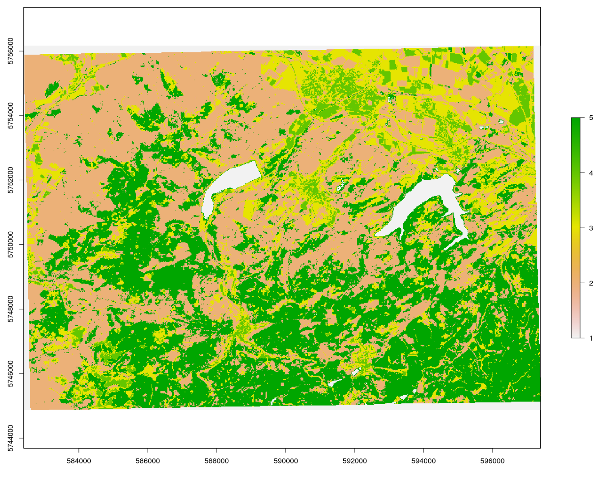

In den Geowissenschaften ist die Fernerkundung das einzige Messverfahren, das eine vollständige meßtechnische Abdeckung großer räumlicher Gebiete bis hin zur gesamten Erdoberfläche ermöglicht. Zur erfolgreichen Nutzung gehört sowohl die Anwendung existierender als auch die Anpassung und Entwicklung eigener Methoden.

# Einleitung 

In der Geo- oder Umweltinformatik ist die Erfassung von Landoberflächen-Veränderungen mittels Satelliten-, Flugzeug- oder Drohnenbildern, die sogenannte Change Detection Analysis ein wichtiger Anwendungsfall. Oft werden solche Ergebnisse mit bio- und geophysikalischen oder anthropogenen Prozessen in Verbindung gebracht, um ein sowohl ein tieferes Verständnis als auch die Möglichkeit zur Entwicklung von Vorhersagemodellen zu erhalten. Um räumliche Informationen aus den zugrundeliegenden Prozessen zu erzeugen sind Bildanalysemethoden von hervorgehobener Bedeutung. Da sowohl Quantität als auch Qualität dieser *Bildaten* einen ständig wachsenden Anteil am Monitoring und der Modellierung der Umwelt übernimmt, ist es zunehmend notwendig *Big Data* Konzepte in die Analysen zu integrieren. Das heisst mit enormen Datenmengen (>> 10 GB) repoduzierbare Analysen vorzunehmen. Dies ist sowohl für den wissenschaftlichen Erkenntnisgewinn als auch für gesellschaftliche Zukunftsaufgaben unausweichlich. 

Wir starten wie bereits einleitend ausgeführt mit einer skalierbaren Change Detection Analyse von Waldschäden in Mittelgebirgen, also einer typischen anwendungsorientierten Aufgabe. Skalierbar heisst dass wir die Analyse mit einem überschaubaren, den Nordwest-Harz abdeckenden Gebiet und auf zwei Zeitslots beschränken. Der resultierende Algorithmus kann jedoch auf räumlich andere oder größere Gebiete sowie zeitlich auf mehr Zeitebenen angewendet werden.

## Informationen aus Bilddaten

Unverarbeitete Satellitenbilder sind nicht notwendigerweise auch informativ. Unser Auge kann zwar ein Echtfarbenbild relativ schlüssig und intuitiv interpretieren, aber eine zuverlässige und reproduzierbare d.h. wissenschaftlich belastbare Interpretation erfordert andere Vorgehensweisen. Ein erhblicher Vorteil von typischen Bildanalysemethoden gegenüber einer visuellen Interpretation ist es zusätzliche, gleichsam *unsichtbare* Informationen ableiten zu können. Wir haben bereits solche einfachen Indizes  wie etwa den NDVI oder die Oberflächenalbedo als physikalisch begründete Umwandlung von Bildsignalen in eine Meßgröße, berechnet. 

Um nützliche oder zielführende Informationen, z. B. über die Bodenbedeckung in einem Gebiet, zu erhalten, müssen wir die Daten daher fragestellungszentriert analysieren. Der wohl bekannteste und gängigste Ansatz ist die überwachte Klassifizierung von Bilddaten in Kategorien die von Interesse sind.

Diese Übung führt Sie in die Klassifizierung von Satelliten- und Luftvermessungsdaten in `R` ein. 

Wir werden uns mit den folgenden Themen beschäftigen:

1. Vorbereiten der Arbeitsumgebung und Laden der Daten
1. Digtalisierung von Trainingsbereichen 
1. Unüberwachte Klassifizierung (kmeans clustering)
1. Modelltraining
1. Überwachte Klassifizierung (random forest, Maximum Likelihood)
1. Güteschätzung Modell


#  Klassifizierung von Fernerkundungsdaten

Bitte beachten Sie, dass alle Arten der Klassifizierung eine in der Regel aufwendige Datenvorverarbeitung erfordern. Im Zentrum stehen dann Modellbildung und Qualitätsschätzung, die als handwerkliche Grundlagen der Klassifizierung betrachtet werden können, um schließlich  in der Datennachverarbeitung die inhaltliche Interpretation der Ergebnisse abzuleiten. Wir werden schrittweise durch diesen Ablauf gehen.


## Überwachte Klassifizierung

Bei der überwachten Klassifizierung von Landbedeckungen wird aus einer begrenzten Menge Trainingsdaten zur Landbedeckung ein Modell abgeleitet, das die jeweilige Landbedeckung für den gesamten Datensatz vorhersagt. Die Landbedeckungstypen werden also *a priori* definiert, und das Modell versucht, diese Typen auf der Grundlage der Ähnlichkeit zwischen den Eigenschaften der Trainingsdaten und dem Rest des Datensatzes vorherzusagen.


Ganz pragmatisch erfordern Klassifizierungsaufgaben im Allgemeinen die folgenden Schritte:

* Zusammenstellung eines umfassenden Eingabedatensatzes, der eine oder mehrere Rasterebenen enthält.
* Auswahl von Trainingsgebieten, d.h. Teilmengen von Eingabedatensätzen, für die der Fernerkundungsexperte den Landbedeckungstyp kennt. Das Wissen über die Landbedeckung kann z.B. aus eigenen oder fremden *in situ* Beobachtungen, Managementinformationen oder anderen Fernerkundungsprodukten (z.B. hochauflösenden Luftbildern) gewonnen werden.
* Training eines Modells unter Verwendung der Trainingsflächen. Zu Validierungszwecken werden die Trainingsflächen häufig in eine oder mehrere Test- und Trainingsstichproben unterteilt, um die Leistung des Modellalgorithmus zu bewerten.
* Anwendung des trainierten Modells auf den gesamten Datensatz, d. h. Vorhersage der Bodenbedeckungsart auf der Grundlage der Ähnlichkeit der Daten an jedem Ort mit den Klasseneigenschaften des Trainingsdatensatzes.


# Change Detection Waldveränderung Nord-West-Harz

In diesem Tutorium werden die Sentinel-2-Bilder aus der vorherigen Übung verwendet. 

## Start - Einrichten des der Arbeitsumgebung
Sie können entweder die gespeicherten Daten aus der vorangegangenen Einheit verwenden oder einen neuen Raumausschnitt bestimmen, herunterladen und bearbeiten. Im Prinzip wird jedoch zuerst die Arbeitsumgebung geladen.

```{r setup , message = FALSE, warnings = FALSE}
#  ---- 0 Projekt Setup ----
# Achtung Pakete müssen evtl. manuell installiert werden
library(envimaR)

#--- Schalter für den Download der sentinel daten
get_sen = FALSE

#--- schalter ob digitalisiert werden muss falls er auf FALSE gesetzt ist werden die
# (zuvor erstellten und gesciherten Daten ) im else Teil der Verzeigung eingelesen
digitize = FALSE

## setzen des aktuellen Projektverzeichnisses (erstellt mit envimaR) als root_folder
#root_folder = find_rstudio_root_file()
root_folder = "~/edu/geoinfo/"
#install.packages("exactextractr")
library(exactextractr)


# Einlesen des zuvor erstellten Setup-Skripts
source(file.path(root_folder, "src/functions/000_setup.R"))

nclasses=2

```

Bitte ergänzen Sie (bei auftreteneden Fehlermeldungen) etwaig fehlende oder defekte Pakete im obigen Setup-Skripts.

Auf der Grundlage der verfügbaren Sentinel Daten sollten nun als Erstes geeignete Datensätze für eine Oberflächenklassifikation identifiziert werden. Hierzu kann der vollständige Datensatz auch vom Kursdatenserver [heruntergeladen](http://gofile.me/3Z8AJ/7Ika7zY9x) werden (Bitte beachten Sie dass sie im VPN bzw. UniNetz angemeldet sein müssen). Entpacken Sie diese Daten in das Wurzelverzeichnis des Kursprojekts. Das heisst der dort bereits vorhandene Ordner `data` wird ersetzt/ergänzt.


## Schritt 1  Übersicht verschaffen 

Bei näherer Betrachtung der RGB Bilder (RGB432B) zeigt sich, das vier Datensätze aufgrund der  Bildqualität und geringen Wolkenbedeckung geeignet zu sein scheinen. Es handelt sich um den 19.06. bzw. 24.7. 2019 und den 33.06 bzw. 30.7. 2020. Aufgrund des früheren Vegetationszeitpunktes wurden die Maibilder gewählt, da hier evtl. Aufwuchs auf den Rodungsflächen weniger stark sichtbar sein könnte. 

Zunächst müssen diese Daten in einem *"Rasterstapel"* also einem Mehrkanalbild verfügbar sein. Bereits bei der ersten Beschäftigung mit dem `sen2r` Paket hatten wir weitere Produkte als sinnvoll erachtet und berechnet. Es sind folgende Indizes:

* Normalized Difference Vegetation Index [NDVI](https://www.indexdatabase.de/db/i-single.php?id=58)
* Modified Soil Adjusted Vegetation Index [MSAVI2](https://www.indexdatabase.de/db/i-single.php?id=44)
* Simple Ratio 1600/820 Moisture Stress Index [MSI](https://www.indexdatabase.de/db/i-single.php?id=48) 
* Modified Soil Adjusted Vegetation Index [SAVI](https://www.indexdatabase.de/db/i-single.php?id=87) 
* Enhanced Vegetation Index [EVI](https://www.indexdatabase.de/db/i-single.php?id=16)


### Download mit sen2r

Diese Daten müssen für den gewünschten Zeitslot und Raumausschnitt besorgt und vorbereitet werden. Aus Gründen der Vereinfachung gibt es für den Kurs eine entsprechende sen2R-Projektdatei:


<p>
  <button class="btn btn-primary" type="button" data-toggle="collapse" data-target="#collapse_json" aria-expanded="false" aria-controls="collapse_json">
    Verwendete sen2R Projektdatei
  </button>
<div class="collapse" id="collapse_json">
  <div class="card card-body">

```r
{
  "preprocess": [true],
  "s2_levels": ["l1c", "l2a"],
  "sel_sensor": ["s2a", "s2b"],
  "online": [true],
  "server": ["scihub"],
  "order_lta": [true],
  "downloader": ["builtin"],
  "overwrite_safe": [false],
  "rm_safe": ["l1c"],
  "max_cloud_safe": [5],
  "step_atmcorr": ["auto"],
  "sen2cor_use_dem": [true],
  "sen2cor_gipp": [null],
  "timewindow": ["2019-06-01", "2020-08-31"],
  "timeperiod": ["seasonal"],
  "extent": ["{\n  \"type\": \"FeatureCollection\",\n  \"features\": [\n    {\n      \"type\": \"Feature\",\n      \"properties\": {\n        \"X_leaflet_id\": 2080,\n        \"layerId\": \"2080\",\n        \"edit_id\": \"2080\"\n      },\n      \"geometry\": {\n        \"type\": \"Polygon\",\n        \"coordinates\": [\n          [\n            [10.198975, 51.848575],\n            [10.198975, 51.947721],\n            [10.413895, 51.947721],\n            [10.413895, 51.848575],\n            [10.198975, 51.848575]\n          ]\n        ]\n      }\n    }\n  ]\n}"],
  "s2tiles_selected": ["32UNC"],
  "s2orbits_selected": [null],
  "list_prods": ["BOA", "SCL", "CLD"],
  "list_indices": ["EVI", "MSAVI2", "MSI", "NDVI", "NDWI2", "SAVI"],
  "list_rgb": ["RGB432B", "RGB843B"],
  "rgb_ranges": [
    [null],
    [
      [0, 7500],
      [0, 2500],
      [0, 2500]
    ]
  ],
  "index_source": ["BOA"],
  "mask_type": ["nodata"],
  "max_mask": [5],
  "mask_smooth": [20],
  "mask_buffer": [10],
  "clip_on_extent": [true],
  "extent_as_mask": [true],
  "extent_name": ["harz"],
  "reference_path": [null],
  "res": [null],
  "res_s2": ["10m"],
  "unit": ["Meter"],
  "proj": [null],
  "resampling": ["near"],
  "resampling_scl": ["near"],
  "outformat": ["GTiff"],
  "rgb_outformat": ["GTiff"],
  "index_datatype": ["Int16"],
  "compression": ["DEFLATE"],
  "rgb_compression": ["DEFLATE"],
  "overwrite": [false],
  "path_l1c": ["~/edu/geoinfo/data/data_lev0"],
  "path_l2a": ["~/edu/geoinfo/data/data_lev0"],
  "path_tiles": [null],
  "path_merged": [null],
  "path_out": ["~/edu/geoinfo/data/data_lev1"],
  "path_rgb": ["~/edu/geoinfo/data/data_lev1"],
  "path_indices": ["~/edu/geoinfo/data/data_lev1"],
  "path_subdirs": [true],
  "thumbnails": [true],
  "log": ["~/edu/geoinfo//doc/nw-harz.log"],
  "parallel": [true],
  "processing_order": ["by_date"],
  "pkg_version": ["1.5.0.9000"]
}

}

```

 </div>
</div>


 Bitte unbedingt beachten das die Daten die älter als 18 Monate sind  im Long Term Archive liegen. 

```{r datendownload, message=FALSE, warning=FALSE}

#--- Download der Daten
# gui = TRUE ruft die GUI zur Kontrolle auf

if (get_sen){
   out_paths_3 <- sen2r(
    gui = T,
    param_list = "~/edu/geoinfo/data/harz_2022.json",
    tmpdir = envrmt$path_tmp,
  )
}

```

In diesem Beispiel löst der obige Befehl eine *Bestellung* aus. `sen2r`  gibt dann dazu eine Meldung aus die unbedingt gespeichert und dann für den  weiteren Download berücksichtigt werden muss. Die Ausgabe schaut vergleichbar wie nachfolgend aus.

 ```
# ╔══════════════════════════════════════════════════════════════════════════════════════════════════════════
# ║ sen2r Processing Report
# ╟──────────────────────────────────────────────────────────────────────────────────────────────────────────
# ║ Dates to be processed based on processing parameters: 9
# ║ Processing completed for: 0 out of 9 expected dates.
# ║ Outputs for: 9 out of 9 expected dates not created because all/some required images are currently
# ║ offline.
# ║ Order for: 9 out of 9 offline images successfull.
# ║ You can check later if the ordered images are online with the command:
# ║   safe_is_online("/home/creu/.sen2r/lta_orders/lta_20220220_134628.json")
# ║ When additional images are online, you can relaunch the processing chain using the command:
# ║   sen2r("/home/creu/.sen2r/proc_par/s2proc_20220220_134550.json")
# ╚══════════════════════════════════════════════════════════════════════════════════════════════════════════
```

Wichtig sind die beiden Befehle mit den *"Vorgangsnummern"*: 
Mit dem ersten Befehl kann gecheckt werden ob die Daten bereits im Zugriff sind. Dies dauert in der Regel nicht länger als 30 Minuten. Mit dem zweiten Befehl können die bestellten Daten heruntergeladen und prozessiert werden. Bitte beachten Sie, dass eine gute Internetverbindung besteht. 

```
safe_is_online("/home/creu/.sen2r/lta_orders/lta_20220220_134628.json")
sen2r("/home/creu/.sen2r/proc_par/s2proc_20220220_134550.json")
```


### Vorbereitung der Daten

Sobald der Download erfolgreich war kann mit der eigenlichen Klassifikation begonnen werden. Zuerst müssen die Daten in technisch geeigneter Weise als  Multikanalbild organisiert werden. Zusätzlich wird ein aktueller bzw. zeitlich korrespondierender Corine Landnutzungsdatensatz geladen, um eine binäre Wald/nicht Wald Maske zu erzeugen. Für den [Download der Corine Daten](https://land.copernicus.eu/pan-european/corine-land-cover) kann das bereits verfügbare Copernicus Konto genutzt werden. Nach dem (manuellen) Download die Daten in das Unterverzeichnis `level0`  entpacken (Achtung hier gibt es nach dem Entpacken des Archivs zahllose Unterverzeichnisse).  Wir benötigen die Datei `U2018_CLC2018_V2020_20u1.tif`. Alternativ kann der bereits korrekt prozesierte und projizierte Datensatz vom github repository (siehe Skript) genutzt werden.


```{r stack, message=FALSE, warnings=FALSE}
#--- Einlesen der Daten aus den Verzeichnissen

##--- Hier wird die Bearbeitung des corine Landnutzungsdatensatz beschrieben
## Die notwendige Datei kann auch aus dem repository heruntergeladen werden
## Für den Download ist ein Konto notwendig https://land.copernicus.eu/pan-european/corine-land-cover
## Daher die Daten manuell herunterladen und in das Verzeichnis kopieren und entpacken
## Dann das nachfolgend auskommentierte Snippet ausführen

# corine_eu = raster(file.path(envrmt$path_data_lev0,"u2018_clc2018_v2020_20u1_raster100m/DATA/U2018_CLC2018_V2020_20u1.tif"))
# tmp = projectRaster(pred_stack_2019[[1]],crs = crs(corine_eu))
# corine_crop = raster::crop(corine_eu,tmp)
# corine_utm = projectRaster(corine_crop,crs = crs(pred_stack_2019))
# corine = resample(corine_utm,pred_stack_2019[[1]])
# raster::writeRaster(corine,file.path(envrmt$path_data_lev0,"/corine.tif"),overwrite=TRUE)

# Alternativ den Beipieldatensatz herunterladen
utils::download.file(url="https://github.com/gisma/gismaData/raw/master/geoinfo/corine.tif",destfile=file.path(envrmt$path_data_lev0,"corine.tif"))
corine = raster("/home/creu/edu/geoinfo/data/data_lev0/corine.tif")

# Erstellen einer Wald-Maske
# Agro-forestry areas code=22, Broad-leaved forest code=23,
# Coniferous forest code=24, Mixed forest code=25
mask = reclassify(corine,c(-100,22,0,22,26,1,26,500,0))
plot(mask)

# RGB stack der beiden Jahre
pred_stack_2019 = raster::stack(list.files(file.path(envrmt$path_data_lev1,"BOA"),pattern = "20190619",full.names = TRUE))
pred_stack_2020 = raster::stack(list.files(file.path(envrmt$path_data_lev1,"BOA"),pattern = "20200623",full.names = TRUE))


# Stack-Loop über die Daten
for (pat in c("EVI","MSAVI2","NDVI","SAVI")){
  pred_stack_2019 = raster::stack(pred_stack_2019,stack(list.files(file.path(envrmt$path_data_lev1,pat),pattern = "20190619",full.names = TRUE)))
  pred_stack_2020 = raster::stack(pred_stack_2020,stack(list.files(file.path(envrmt$path_data_lev1,pat),pattern = "20200623",full.names = TRUE)))
}
# get rid of NA
pred_stack_2019 = reclassify(pred_stack_2019, cbind(NA, 0))
pred_stack_2020 = reclassify(pred_stack_2020, cbind(NA, 0))

# Zuweisen von leserlichen Namen auf die Datenebenen
names(pred_stack_2019) = c("band1","band2","band3","band4","band5","band6","band7","band8","band9","band10","band11","EVI","MSAVI2","NDVI","SAVI")
names(pred_stack_2020) =  c("band1","band2","band3","band4","band5","band6","band7","band8","band9","band10","band11","EVI","MSAVI2","NDVI","SAVI")
saveRDS(pred_stack_2019,paste0(envrmt$path_data,"pred_stack_2019.rds"))
saveRDS(pred_stack_2020,paste0(envrmt$path_data,"pred_stack_2020.rds"))
pred_stack_2019 = readRDS(paste0(envrmt$path_data,"pred_stack_2019.rds"))
pred_stack_2020 = readRDS(paste0(envrmt$path_data,"pred_stack_2020.rds"))


# visuelle Überprüfung der stacks
plot(pred_stack_2019)
plot(pred_stack_2020)

```

###  Erster Eindruck - K-Means Cluster-Klassifikation  

Die wohl bekannteste unüberwachte Klassifizierungstechnik ist das K-means-Clustering, das auch als der *"einfachster  Algorithmus des maschinellen Lernens"* bezeichnet wird. Er wird häufig angewendet um einen ersten Überblick zu erhaltne ob die Rasterdaten im Merkmalsraum ausreichend trennbar sind.

In unserem Beispiel (auf 5 Klassen angewendet und mit `unsuperClass` Funktion aus dem `RStoolbox` Paket ausgeführt) sieht das wie folgt aus. Der Clusteralgorithmus kann mit 5 Clustern eine recht passable Trennung der Lichtungen/Kahlschläge hinbekommen was eine Klassifikation vielversprechend erscheinen läßt. Experimetiren sie auch  mit anderen Clustereinstellungen und diskutieren sie die Ergebnisse. 

```r
## k-means über RStoolbox
# Modell
prediction_kmeans_2019 = RStoolbox::unsuperClass(pred_stack_2019, nClasses = 5,norm = TRUE, algorithm = "MacQueen")
# Klassifikation
plot(prediction_kmeans_2019$map)

prediction_kmeans_2020 = RStoolbox::unsuperClass(pred_stack_2020, nClasses = 5,norm = TRUE, algorithm = "MacQueen")
plot(prediction_kmeans_2020$map)
```




## Schritt 2 - Trainingsdaten erstellen

Für eine überwachte Klassifikation benötigen wir Daten die ausweisen zu welcher Oberflächenklasse definierte Flächen des Satellitenbildes gehören. diese Daten werden Trainingsdaten genannt und sehr häufig durch manuelles abdigitalisieren erfasst. Dies kann recht komfortabel in RStudio durchgeführt werden, falls nur schnell und effektiv einige wenige Trainingsflächen zu digitalisieren sind. 

Für größere Aufgaben ist es sinnvoll, auf den hohen Komfort z.b. der [Digitalisierung Turorial](https://docs.qgis.org/3.16/en/docs/training_manual/create_vector_data/create_new_vector.html#basic-ty-digitizing-polygons) in the QGIS 3.16 documentation zurückgreifen.

## Trainingsdaten digitalisieren

Wir nehmen an, dass wir zwei Arten von Landbedeckung klassifizieren wollen: *clearcut* (Abholzungen) und *other* (Anderes). Mit mapedit `muss jede Klasse **einzeln** digitalisiert werden. Sobald die Trainingsgebiete als Vektordaten verfügbar sind können die Merkmale des jeweiligen Rasterstacks entsprechend der digitalisierten Klassen in eine Tabelle extrahiert und auf etwaige Fehlwerte bereiningt werden. 


<div class="boxSuccess">
<p class="textline"> 
Falls dieser Teil bereits absolviert wurde kann die logische Variable (am Anfang des Scripts definiert) *digitize* auf *FALSE*  gesetzt werden und es wird dann der *else* Teil der Verzweigung durchlaufen - also nur noch die existierenden Daten eingelesen.
</div>


<p>
<button class="btn btn-primary" type="button" data-toggle="collapse" data-target="#collapse_2" aria-expanded="false" aria-controls="collapse_2">
</p>
Exkurs: Trainingsgebiete mit mapedit erfassen
</button>
<div class="collapse" id="collapse_2">
  <div class="card card-body">
  

### Verwendung von Farbkomposita für bessere Trainingsergebnisse

Für diese Übung verwenden wir `mapedit`, ein kleines, aber feines Paket, das die Digitalisieren und Editieren  von Vektordaten im Rstudio- oder externen -browser ermöglicht. In Kombination mit `mapview` können auch beliebige  [Farbkomposita](https://custom-scripts.sentinel-hub.com/custom-scripts/sentinel-2/composites/) als Grundlage für die Digitalisierung verwendet werden. 

```r

m1 = tm_shape(pred_stack_2019) + tm_rgb(r=4, g=3, b=2) +
  tm_layout(legend.outside.position = "right",
            legend.outside = T,
            panel.label.height=0.6,
            panel.label.size=0.6,
            panel.labels = c("r=1, g=2, b=3")) +
  tm_grid()

m2 = tm_shape(pred_stack_2019) + tm_rgb(r=8, g=4, b=3) +
  tm_layout(legend.outside.position = "right",
            legend.outside = T,
            panel.label.height=0.6,
            panel.label.size=0.6,
            panel.labels = c("r=8, g=4, b=3")) +
  tm_grid()
tmap::tmap_arrange(m1,m2)
  
```


Verwenden Sie die Ebenensteuerung, um die Ebenen umzuschalten.
  Bei Echtfarbkompositen werden die sichtbaren Spektralkanäle Rot (B04), Grün (B03) und Blau (B02) den entsprechenden roten, grünen bzw. blauen Farbkanälen zugeordnet, wodurch ein quasi natürliches *"farbiges"* Bild der Oberfläche entsteht, wie es ein Mensch sehen würde, der auf dem Satelliten sitzt.
  Falschfarbenbilder werden häufig mit den Spektralkanälen für das nahe Infrarot, Rot und Grün erzeugt. Sie eignen sich hervorragend für die Einschätzung der Vegetation, da Pflanzen nahes Infrarot und grünes Licht reflektieren, während sie rotes Licht absorbieren (Red Edge Effect). Ein dichterer Pflanzenbewuchs ist dunkler rot. Städte und offener Boden sind grau oder hellbraun, und Wasser erscheint blau oder schwarz. 

  

```{r digitize, echo=TRUE}

#---- Digitalisierung der Trainingsdaten ----

if (digitize) {
  # Für die überwachte Klassifikation benötigen wir Trainingsgebiete. Sie können Sie wie nachfolgend digitalisieren oder alternativ z.B. QGis verwenden
  
  # clearcut
  
  # Für das Falschfarbenkomosit r = 8, g = 4, b = 3, maxpixels =  1693870)
  # maxpixels hat deutlich höheren speicherbedarf, Vegetation in Rot
  # nachfolgend das Echtfarbkomposit
  train_area_2019 <- mapview::viewRGB(pred_stack_2019, r = 4, g = 3, b = 2, maxpixels =  1693870) %>% mapedit::editMap()
  # Hinzufügen der Attribute class (text) und id/year (integer)
  clearcut_2019 <- train_area_2019$finished$geometry %>% st_sf() %>% mutate(class = "clearcut", id = 1,year=2019)
  train_area_2020 <- mapview::viewRGB(pred_stack_2020, r = 4, g = 3, b = 2,maxpixels =  1693870) %>% mapedit::editMap()
  clearcut_2020 <- train_area_2020$finished$geometry %>% st_sf() %>% mutate(class = "clearcut", id = 1,year=2020)
  
  # other: alle nicht zu Kahlschlag  gehörenden Flächen möglichst repräsentativ
  train_area_2019 <- mapview::viewRGB(pred_stack_2019, r = 4, g = 3, b = 2) %>% mapedit::editMap()
  other_2019 <- train_area_2019$finished$geometry %>% st_sf() %>% mutate(class = "other", id = 2,year=2019)
  train_area_2020 <- mapview::viewRGB(pred_stack_2020, r = 4, g = 3, b = 2) %>% mapedit::editMap()
  other_2020 <- train_area_2020$finished$geometry %>% st_sf() %>% mutate(class = "other", id = 2,year=2020)
  
  train_areas_2019_2020 <- rbind(clearcut_2019,clearcut_2020, other_2019,other_2020)  # Umprojizieren auf die Raster Datei
  train_areas_2019 = sf::st_transform(train_areas_2019_2020,crs = sf::st_crs(pred_stack_2019))
  mapview(filter(train_areas_2019_2020,year==2019), zcol="class")
  # sichern der geometrien
  st_write(train_areas_2019_2020,paste0(envrmt$path_data,"train_areas_2019_2020.gpkg"))
  
  # Extraktion der Trainingsdaten für die digitalisierten Flächen
  tDF_2019 = exactextractr::exact_extract(pred_stack_2019, filter(train_areas_2019_2020,year==2019),  force_df = TRUE,
                                          include_cell = TRUE,include_xy = TRUE,full_colnames = TRUE,include_cols = "class")
  tDF_2020 = exactextractr::exact_extract(pred_stack_2020, filter(train_areas_2019_2020,year==2020),  force_df = TRUE,
                                          include_cell = TRUE,include_xy = TRUE,full_colnames = TRUE,include_cols = "class")
  
  #  auch hier wieder zusamenkopieren in eine Datei
  tDF_2019 = dplyr::bind_rows(tDF_2019)
  tDF_2019$year = 2019
  tDF_2020 = dplyr::bind_rows(tDF_2020)
  tDF_2020$year = 2020
  # Löschen von etwaigen Zeilen die NA (no data) Werte enthalten
  tDF_2019 = tDF_2019[complete.cases(tDF_2019) ,]
  tDF_2020 = tDF_2020[complete.cases(tDF_2020) ,]
  
  tDF= rbind(tDF_2019,tDF_2020)
  
  # check der extrahierten Daten
  summary(tDF)
  
  # Abspeichern als R-internes Datenformat
  # ist im Repo hinterlegt und kann desahlb (zeile drunter) eingeladen werden
  saveRDS(tDF, paste0(envrmt$path_data,"tDF.rds"))

  
  
} else {
  tDF = readRDS(paste0(envrmt$path_data,"tDF.rds"))
}
```

Als Resultat liegt nun eine Tabele mit den Trainingsdaten  für 2019 und 2020 vor. Der Datensatz beinhalten alle Rasterinformationen über alle Bänder die von den Polygonen für die Klassen *"clearcut"* und *"other"* abgedeckt werden. 

```{r raw_train, echo=TRUE}
head(tDF)
```  

</div>
</div>


## Schritt 3 - Modelltraining, Prüfen der Modellgüte, Klassifikation

Klassifikatoren (z.B der Maximum-Likelihood Klassikator) oder Algorithmen des maschinellen Lernens (wie z. B. Random Forest)  ermitteln auf Basis der Trainingsdaten Beschreibungsmodelle die z.B. statistische Signaturen,  Klassifikationsbäume  oder andere Funktionen darstellen. Im Rahmen der Güte der Trainingsdaten  sind solche Modelle geeignet und repräsentativ um  Vorhersagen für Räume zu treffen falls die Prädiktoren aus dem Modell flächendeckend vorhanden sind. 

Wir wollen nun die räumlichen Merkmale Kahlschlag/kein Wald exemplarisch mit einer Maximum Likelihood Klassifikation und mit Random Forest vorhersagen und Standardmethoden der Zufallsvalidierung und Modellgüteeinschätzung anwenden. 

Ziel ist es Kahlschläge von allen anderen Pixeln zu trennen und die Unterschide von 2019/2020 zu quantifizieren.


###  Maximum Likelihood Klassifikation

Bei der Maximum-Likelihood-Klassifizierung wird davon ausgegangen, dass die Verteilung der Daten für jede Klasse und in jedem Kanal normal verteilt sind. Unter dieser Vorraussetzung wird die Wahrscheinlichkeit berechnet, dass ein bestimmtes Pixel zu einer bestimmten Klasse gehört. Da auch die Wahrscheinlichkeiten als Schwellenwert angegeben werden können werden ohne diese Einschränkung *alle* Pixel ungeachtet wie unwahrscheinlich zugeordnet. Jedes Pixel wird der Klasse zugeordnet, die die höchste Wahrscheinlichkeit aufweist (d. h. die maximale Wahrscheinlichkeit).


Da der Maximum-Likelihood-Algorithmus Trainingsdaten benötigt, handelt es sich um eine überwachte Lernmethode. Das bedeutet, dass wir als Nutzer dem Algorithmus Daten zur Verfügung stellen müssen, die im Wissen über die vorherzusagenden Klassen vermitteln. Diese Daten werden dann in Trainings- und Testdaten aufgeteilt.


```{r maxlike , message = FALSE, warnings = FALSE}
# ---- Maximum Likelihood Classification ----

tDF = readRDS(paste0(envrmt$path_data,"tDF.rds"))
  
## Hier wird der Random Forest über das Utility Paket caret aufgerufen
# Setzen eines "seed" ermöglicht reproduzierbaren Zufall
set.seed(123)

# Zufälliges Ziehen von 15% der Daten (Training/Test)
idx = createDataPartition(tDF$class,list = FALSE,p = 0.05)
trainDat = tDF[idx,]
testDat = tDF[-idx,]

#  Response-Variable (=Spalte "class") muss den Datentyp "factor" haben
trainDat$class <- as.factor(trainDat$class)
testDat$class <- as.factor(testDat$class)


# superClass() Funktion aus dem Paket RSToolbox erfordet die Konvertierung der Tabelle in das
# geforderte (alte) SpatialdataPointObjekt

sp_trainDat = trainDat
sp_testDat  = testDat 
sp::coordinates(sp_trainDat) = ~x+y
sp::coordinates(sp_testDat) = ~x+y
crs(sp_trainDat) = crs(pred_stack_2019)
crs(sp_testDat) = crs(pred_stack_2019)


# superClass method "mlc" trainiert das Modell und klassifiziert im Anschluss
#raster::beginCluster(30)
prediction_mlc_2019   <- superClass(pred_stack_2019, trainData = sp_trainDat[,1:16],valData = sp_testDat[,1:16], responseCol = "class", model = "mlc", tuneLength = 1, trainPartition = 0.3,verbose = TRUE)

prediction_mlc_2020       <- superClass(pred_stack_2020, trainData = sp_trainDat[,1:16],valData = sp_testDat[,1:16], responseCol = "class",model = "mlc", tuneLength = 1, trainPartition = 0.3,verbose = TRUE)
saveRDS(prediction_mlc_2019, paste0(envrmt$path_data,"prediction_mlc_2019.rds"))
saveRDS(prediction_mlc_2020, paste0(envrmt$path_data,"prediction_mlc_2020.rds"))
```


### Random forest

Random Forests können sowohl für Regressions- als auch für Klassifizierungsaufgaben verwendet werden, wobei letztere besonders in der Umwelt-Fernerkundung relevant sind. Wie bei jeder maschinellen Lernmethode lernt auch das Random-Forest-Modell, Muster und Strukturen in den Daten selbst zu erkennen. Da auch der Random-Forest-Algorithmus Trainingsdaten benötigt, handelt es sich ebenfalls um eine überwachte Lernmethode.
!

Abbildung: Vereinfachte Darstellung der Klassifizierung von Daten durch Random Forest während des Trainings. Venkata Jagannath [CC BY-SA 4.0] via wikipedia.org

Ein Random-Forest-Algorithmus lernt über die Daten, indem zufällige Entscheidungsbäume erstellt werden - daher auch der Name. Für Klassifizierungsaufgaben nimmt der Algorithmus eine passende Instanz eines Entscheidungsbaumes aus dem Trainingsdatensatz und weist dem Pixel die korrespondierende Klasse zu. Dies wird mit allen verfügbaren Entscheidungsbäuumen wiederholt. Letzlichwird nach dem Winner-takes-it-all Prinzip das Pixel der Klasse zugeordnet, die die meisten Bäume aufweist.


```{r random_forest , message = FALSE, warnings = FALSE}

# Einstellungen Modelltraining: cross-validation, 10 Wiederholungen
ctrlh = trainControl(method = "cv",
                     number = 10,
                     savePredictions = TRUE)

#--- random forest model training
rf_model = train(trainDat[,2:16],      # in den Spalten 2 bis 16 stehen die Trainingsdaten (Prediktoren genannt)
                      trainDat[,1],         # in der Spalte 1 steht die zu klassizierende Variable (Response genannt)
                      method = "rf",        # Methode hier rf für random forest
                      metric = "Kappa",     # Qualitäts/Performanzmaß KAppa
                      trControl = ctrlh,    # obig erzeugte Trainingssteuerung soll eingelsen werden
                      importance = TRUE)    # Die Bedeung der Variablen wird mit abgespeichert

rf_model

#saveRDS(rf_model, paste0(envrmt$path_data,"rf_model.rds"))
```


### Schätzung Modellgüte  

Die Testdaten werden nun für die unabhängige Qualitätsprüfung des Modells verwendet. Eine Wahrheits- oder Konfusionsmatrix zeigt an, wie präzise das Modell die korrekten Klassen vorhersagt. Die Hauptdiagonale der Matrix zeigt die Fälle an, in denen das Modell zutrifft. In unserer Klassifikation von nur 2 Klassen gilt allerdings der Sonderfall einer [Beurteilung eines binären Klassifikators](https://en.wikipedia.org/wiki/Evaluation_of_binary_classifiers). 
Speziell für die hier verwendete Funktion finden sich ausführliche Erläuertungen in der [caret Hilfe](https://topepo.github.io/caret/measuring-performance.html#measures-for-predicted-classes).

Die wesentlichen Ausagen zur Modellgüte sind : 

*  *'Positive' Class* = **clearcut**: wird mit der Sensitivität (*true positive rate*) erfasst, die die  Wahrscheinlichkeit angibt, mit der ein positives Objekt korrekt als positiv klassifiziert wird.
*  *'Negative Class'* = **other**: wird mit der Spezifität (*true negative rate*) erfasst und gibt die Wahrscheinlichkeit an, mit der ein negatives Objekt korrekt als negativ klassifiziert wird
*  *Positive and negative predictive values*  geben für *clearcut* bzw. *other* die reale Perfomance an. Sie sind um die reale Häufigkeitsverteilung korrigiert und ein Schätzmass für die Präzision bzw. Performance des Modells bezüglich der jeweiligen Klassen. 

Trotz der hohen Werte sehen wir, dass die Klasse *clearcut* hier deutlich abfällt. Das kann durchaus als Hinweis auf die Notwendigkeit zur Verbesserung der Klassifikation aufgefasst werden. 

Insgesamt kann das Modell jedoch als gut bezeichnet werden.


```{r konfusiomatrix2019, message = FALSE, warnings = FALSE}

# ---- Berechnung der Konfusionsmatrix  ----
cm_rf <- confusionMatrix(data = predict(rf_model, newdata = testDat), testDat$class)
cm_rf
```


### Vorhersage auf die Ausgangsdaten

Nun sind wir soweit das überprüfte Modell auf unseren Datensatz anzuwenden. Üblicherweise wird das in der Fernerkundung Klassifikation genannt. 

```{r klassifikation2019, message = FALSE, warnings = FALSE}
# Klassifikation (auch Vorhersage genannt)
prediction_rf_2019  = raster::predict(pred_stack_2019 ,rf_model)
prediction_rf_2020  = raster::predict(pred_stack_2020 ,rf_model)
saveRDS(prediction_rf_2019, paste0(envrmt$path_data,"prediction_rf_2019.rds"))
saveRDS(prediction_rf_2020, paste0(envrmt$path_data,"prediction_rf_2020.rds"))

```

 


```{r vergleichklassifikationen}
prediction_rf_2019 = readRDS(paste0(envrmt$path_data,"prediction_rf_2019.rds"))
prediction_rf_2020 = readRDS(paste0(envrmt$path_data,"prediction_rf_2020.rds"))
prediction_mlc_2019 = readRDS(paste0(envrmt$path_data,"prediction_mlc_2019.rds"))
prediction_mlc_2020 = readRDS(paste0(envrmt$path_data,"prediction_mlc_2020.rds"))
## ---- Visualisierung mit mapview ----
mapview::mapshot(mapview::viewRGB(mask*pred_stack_2020, r = 4, g =3, b = 2,maxpixels =  1693870)+
  mapview(mask*prediction_rf_2019 , alpha.regions = 0.5, maxpixels =  1693870,
          col.regions = mapviewPalette("mapviewRasterColors"),at = seq(0, nclasses, 1), legend = TRUE) +
  mapview(mask*prediction_rf_2020, alpha.regions = 0.5, maxpixels =  1693870,
          col.regions = mapviewPalette("mapviewRasterColors"),at = seq(0, nclasses, 1), legend = FALSE) +
  mapview(mask*prediction_mlc_2019$map,alpha.regions = 0.5, maxpixels =  1693870,
          col.regions = mapviewPalette("mapviewRasterColors"),at = seq(0, nclasses, 1), legend = FALSE) +
  mapview(mask*prediction_mlc_2020$map,alpha.regions = 0.5, maxpixels =  1693870,
          col.regions = mapviewPalette("mapviewRasterColors"),at = seq(0, nclasses, 1), legend = FALSE),url = "compare-class.html")

```

<iframe valign="center" src="compare-class.html" width="1024" height="960" frameborder="0" allowfullscreen="allowfullscreen">
</iframe>
<figcaption>*Comparison of the two years and RF and MLC classification *</figcaption>

<p>
Bei einem visuellen Vergleich fällt auf, dass die `Random Forest` und `Maximumlikelihood` Klassifikationen Ergebnisse von vergleichbarer Güte liefern. Doch hält dieser Eindruck einer quantitativen Überprüfung Stand?

##  Weiterführende Unterstützung

Betrachten Sie die nachfolgenden Ressourcen als Beispiele dafür, wie aus solchen, im Internet vielfältig verfügbaren Anleitungen, sich schrittweise eine bestimmte konzeptionelle und technische Vorgehensweise zur Bearbeitung einer Fragestellung *"herauskristallisiert"*. Nach viel Recherchearbeit und kritischer Gegenprüfung wird so ein aktuell innerhalb der wissenschaftlcihen Gemeinschaft als gesichert geltender *"Stand der Forschung"*  identifiziert, der als zureichende Grundlage guter wissenschaftlicher Praxis betrachtet werden kann. 

Arbeiten/Lesen Sie, auch zu Übungszwecken,  die nachstehende Auswahl von Blogs und Hilfestellungen einmal durch. 

* Robert J. Hijmans [rspatial - supervised classification](https://rspatial.org/raster/rs/5-supclassification.html)
* Ivan Lizarazo [RPubs Tutorial](https://rpubs.com/ials2un/rf_landcover)
* Sydney Goldstein [blog](https://urbanspatial.github.io/classifying_satellite_imagery_in_R/)
* João Gonçalves [supervised classification](https://www.r-exercises.com/2018/03/07/advanced-techniques-with-raster-data-part-2-supervised-classification/)
* Valentin Stefan [pixel-based supervised classification](https://valentinitnelav.github.io/satellite-image-classification-r/)


Sie finden in den Beiträgen immer beides, technische Anleitungen und konzeptionelle oder konkrete fachliche Fragestellungen und Lösungswege. Sie ersetzen keineswegs die fachwissenschaftlichen Knntnisse. Aber Sie zeigen auf wie technisches und konzeptionelles Verständnis schrittweise erarbeiet werden kann und unterstützen, durch *"nachkochen"* und anwenden, die Kompetenzen eigenständig die Beantwortung von Fragestellungen anzugehen.

Ich möchte ausdrücklich Valentin Stefan den Autor des  Blogbeitrags [pixel-based supervised classification](https://valentinitnelav.github.io/satellite-image-classification-r/) zitieren: 


<div class="boxSuccess">
<p class="textline"> 
*"[...] Betrachten Sie diesen Inhalt als einen Blogbeitrag und nichts weiter. Er erhebt nicht den Anspruch, eine erschöpfende Übung oder ein Ersatz für Ihr kritisches Denken zu sein. [...]"* 
</div>

<div class="boxInfo">
<p class="textline"> 
Sie können alle notwendigen Skripte und Daten aus dem github repository [laden](https://github.com/gisma/geoinfo/archive/refs/heads/main.zip). Alternativ können sie das Repo auch als Projekt in Rstudio anlegen [Rstudio github](https://www.r-bloggers.com/2015/07/rstudio-and-github/).
´</div>